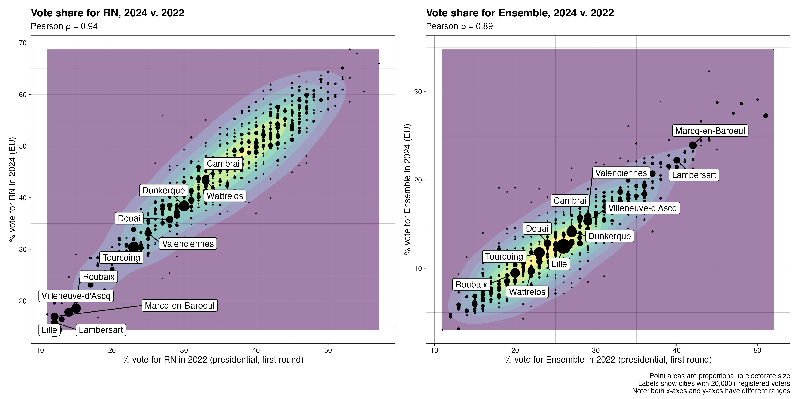

# REPERE 2024

The code and data in this repo are part of the [REPERE][repere] (_Recherche Empirique sur la Participation Électorale des Ressortissants Européens_) and [ECREMEE][ecremee] research projects. The repo focuses on the _département du Nord_ and the EU elections of 2024.

[repere]: https://sms.univ-tlse2.fr/accueil-sms/la-recherche/operations-structurantes/repere-recherche-empirique-sur-la-participation-electorale-des-ressortissants-europeens
[ecremee]: https://anr.fr/Project-ANR-22-CE41-0006

See [Kelbel _et al._ 2024][pag24] for earlier results on the 2020 municipal elections.

[pag24]: https://doi.org/10.17645/pag.7507

## Contents

## `data-cities`

City-level data:

- `border` -- contiguity to Belgian border
  - Source: fieldwork, 2020
  - __N.B.__ The script in this folder requires two unreleased datasets used in [Kelbel _et al._ 2024][pag24]. The `border.tsv` dataset contains some of the same information, with minor corrections.
- `census` -- population characteristics extracted from the 2021 census
  - Source: [Insee, 2024][census]
- `density` -- population density, continuous and categorical
  - Source: [Insee, 2024][density]
- `geography` -- spatial boundaries and centroids
  - Source: [Etalab, 2024][geo]
- `population` -- legal population sizes
  - Source: [Insee, 2024][legal-pop]

[census]: https://www.insee.fr/fr/statistiques/5359146
[density]: https://www.insee.fr/fr/information/2114627
[geo]: https://geo.api.gouv.fr/
[legal-pop]: https://www.insee.fr/fr/statistiques/7739582

## `data-elections`

Electoral data, scraped from the [Web archive][elections] of the Ministry of the Interior:

- `eur-2024` -- turnout in the 2024 EU elections
- `mun-2020` -- turnout in the 2020 municipal elections
  - Also includes code to determine the (often missing) left-right position of the municipal majority, as determined by council seats.
- `pre-2024` -- turnout and results of the 2022 presidential election

[elections]: https://www.archives-resultats-elections.interieur.gouv.fr/

## `data-lists`

Data from the 2024 electoral lists:

- `councillors` -- non-French voters on municipal councils
  - Source: [RNE (Ministry of the Interior), 2024][rne]
- `coverage` -- data collection coverage
  - Report: [coverage.md](data-lists/coverage/coverage.md)
  - Source: fieldwork, 2024
- `electorate` -- registered voters
  - Report: [electorate.md](data-lists/electorate/electorate.md)
  - Source: [Préfecture du Nord][pref59], 2024
  - __N.B.__ When lists are updated with new data from the _Préfecture_, make sure to refresh all `electorate-.*.rds` files, as well as `electorate-counts.tsv`, as well as any script that produces anything based on these datasets.
- `panel` -- find voters observed in both 2020 and 2024
  - Report: [panel.md](data-lists/panel/panel.md)
  - Sources: fieldwork, 2020, and lists of registered voters, [Préfecture du Nord][pref59], 2024
- `vote2024` -- observed voting patterns
  - Report: [vote2024.md](data-lists/vote2024/vote2024.md)
  - Source: fieldwork, 2024

[pref59]: https://www.nord.gouv.fr/
[rne]: https://www.data.gouv.fr/fr/datasets/repertoire-national-des-elus-1/

__N.B.__ The scripts in this folder rely on several restricted-access datasets that contain personal information on voters. In all published material, personal information is replaced with `pid` [128-bit hashes][hash] based on family names, first names (replaced with "NA" when missing) and dates of birth (also replaced with "NA" when missing, which occurs only in the 2020 sample).

[hash]: https://rlang.r-lib.org/reference/hash.html

## `data-nationalities`

Data on non-French EU nationalities, at the national and departmental levels:

- `nationalities` -- counts of top 8 non-French EU nationalities (source: census, 2021)

__N.B.__ The counts and proportions for "Other EU" nationalities is an approximation for _each_ other EU nationality, obtained by dividing the total number of "Other EU" nationals by 18 (EU 27 - French - top 8 non-French nationalities).

## `plot-cartograms`

Contiguous and non-overlapping [circle cartograms][dorling96] of abstention and turnout rates.

Example:


[dorling96]: https://www.dannydorling.org/wp-content/files/dannydorling_publication_id1448.pdf

## `plot-choropleths`

Maps of electorate sizes in the 2024 EU elections.

Example:


## `plot-turnout`

Scatterplots of turnout in the 2024 EU elections vs. previous years:


## `plot-turnout`

Scatterplots of vote shares in the 2024 EU elections vs. the 2022 presidential election.

Example:



## Dependencies

```r
library(tidyverse)
fs::dir_ls(glob = "*r", recurse = TRUE) %>% 
    map(read_lines) %>% 
    map(str_subset, "library\\(") %>% 
    unlist() %>% 
    unique() %>% 
    sort() %>% 
    cat(sep = "\n")
    
library(cartogram)
library(ggrepel)
library(jqr)
library(patchwork)
library(rvest) # bundled with the {tidyverse}
library(sf)
library(tidyverse)
```

## HOWTO

The code below will refresh all datasets, plots and reports.

```r
# fs::dir_ls(glob = "*r", recurse = TRUE)

# [1] generate datasets

# city-{centres,contours}.rds
source("data-cities/geography/geography.r")
# population.tsv
source("data-cities/population/population.r")
# turnout-eur-2024.tsv
source("data-elections/eur-2024/eur-2024.r")
# results-eur-2024.tsv
source("data-elections/eur-2024/results-eur-2024.r")
# turnout-mun-2020-r[12].tsv
source("data-elections/mun-2020/mun-2020.r")
# turnout-pre-2022-r[12], results-pre-2022-r[12].tsv
source("data-elections/pre-2022/pre-2022.r")
# vshares-pre-2022.tsv
source("data-elections/pre-2022/vshares-pre-2022.r")
# coverage.tsv
source("data-lists/coverage/coverage.r")
# electorate-{eur,mun,ppl}.rds, electorate-counts.tsv
source("data-lists/electorate/electorate.r")
# panel.tsv
source("data-lists/panel/panel.r")

# [2] generate plots

source("data-lists/coverage/plot-coverage.r")
source("plot-cartograms/plot-cartograms.r")
source("plot-choropleths/plot-choropleths.r")
source("plot-turnout/plot-turnout.r")
source("plot-vshares/plot-vshares.r")

# [3] generate reports
library(knitr)

# coverage.md
knitr::knit("data-lists/coverage.rmd")
```
