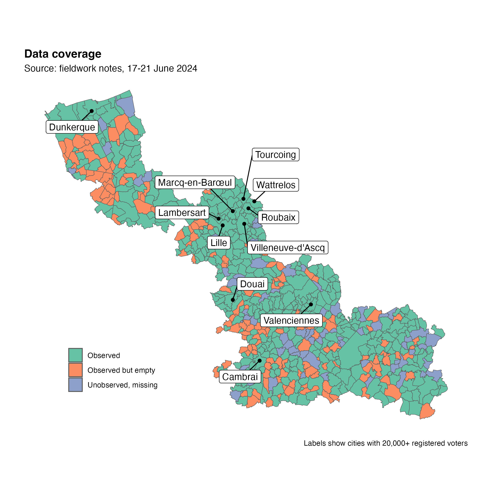

## Weight of missing cities in overall city sample

|                     | Cities | % cities |    Voters | % voters | EU voters | % EU voters |
|:--------------------|-------:|---------:|----------:|---------:|----------:|------------:|
| Observed            |    428 |     66.0 | 1,636,080 |     89.4 |     9,372 |        90.4 |
| Observed but empty  |    152 |     23.5 |   116,048 |      6.3 |       360 |         3.5 |
| Unobserved, missing |     68 |     10.5 |    77,614 |      4.2 |       632 |         6.1 |
| Total               |    648 |    100.0 | 1,829,742 |    100.0 |    10,364 |       100.0 |

Sources: fieldwork notes, prefectural lists.

“Observed but empty” means that the cities were inspected during
fieldwork but did not provide a complementary list of EU voters.

Relationship to `n_eur`:

``` r
# cities with n_eur > 0 should be 'Observed'
table(d$status, d$n_eur > 0)
```

    ##                      
    ##                       FALSE TRUE
    ##   Observed               15  413
    ##   Observed but empty    103   49
    ##   Unobserved, missing     7   61

``` r
100 * prop.table(table(d$status, d$n_eur > 0), 1) # 96% covered
```

    ##                      
    ##                           FALSE      TRUE
    ##   Observed             3.504673 96.495327
    ##   Observed but empty  67.763158 32.236842
    ##   Unobserved, missing 10.294118 89.705882

Remarks:

- The voting lists of 68 cities (10% of total) could not be observed
  during fieldwork, as they could not be located by the prefectural
  staff.
- In addition, 152 cities did not separate EU voters from French
  nationals in their lists, which led us to drop them from the
  observation pool.
- Roughly 10% of EU voters are registered in these missing cities, which
  are all small-size cities with less than 5,000 residents:

``` r
group_by(d, status) %>% 
  summarise(n = n(), median_voterpop = median(n_ins))
```

    ## # A tibble: 3 × 3
    ##   status                  n median_voterpop
    ##   <fct>               <int>           <dbl>
    ## 1 Observed              428           1428.
    ## 2 Observed but empty    152            537 
    ## 3 Unobserved, missing    68            778

The amount of missing data is very reasonable, and is unlikely to cause
sampling bias.

## Spatial distribution of missing cities



Given the limited amount of missing data, we did not test for complete
spatial randomness, but a rough test of median latitude and longitude of
the city centroids return only weak and statistically insignificant
effects.

    ## 
    ## Call:
    ## glm(formula = status == "Unobserved, missing" ~ north + east + 
    ##     n_ins, data = xy)
    ## 
    ## Coefficients:
    ##               Estimate Std. Error t value Pr(>|t|)    
    ## (Intercept)  1.512e-01  1.797e-02   8.411 2.61e-16 ***
    ## northTRUE   -4.585e-02  3.075e-02  -1.491    0.136    
    ## eastTRUE    -3.393e-02  3.044e-02  -1.115    0.265    
    ## n_ins       -2.246e-06  1.695e-06  -1.325    0.186    
    ## ---
    ## Signif. codes:  0 '***' 0.001 '**' 0.01 '*' 0.05 '.' 0.1 ' ' 1
    ## 
    ## (Dispersion parameter for gaussian family taken to be 0.0926768)
    ## 
    ##     Null deviance: 60.864  on 647  degrees of freedom
    ## Residual deviance: 59.684  on 644  degrees of freedom
    ## AIC: 303.58
    ## 
    ## Number of Fisher Scoring iterations: 2

## Consistency with 2020 model samples

The models are those featured in [Kelbel *et al.*
2024](https://doi.org/10.17645/pag.7507), which focused on the 2020
municipal elections.

### Consistency with **Model 1** (restricted to cities \> 5,000 residents)

| status              | Included | Ignored | Excluded |
|:--------------------|---------:|--------:|---------:|
| Observed            |       80 |      59 |      289 |
| Observed but empty  |        1 |      91 |       60 |
| Unobserved, missing |        0 |      12 |       56 |

“Ignored” means that the data contained no EU voters for these cities.

Single problematic case (included in 2020 but unobserved or empty in
2024): Dechy (8 registered EU voters).

Kelbel *et al.* 2024 report a sample size of 6,268 voters in the 101
cities included in Model 1. Using prefectural lists and legal
populations of 2021, our estimate is that the same model estimated on
the 2024 sample will likely include **6,890** voters from **106**
cities.

### Consistency with **Model 4** (estimated on full city sample)

| status              | Included | Ignored | Excluded |
|:--------------------|---------:|--------:|---------:|
| Observed            |      364 |      59 |        5 |
| Observed but empty  |       61 |      91 |        0 |
| Unobserved, missing |       56 |      12 |        0 |

Number of problematic cases (included in 2020 but unobserved or empty in
2024): 117 cities, totalling 926 registered EU voters (8.9% of all
registered EU voters).

Top 5 problematic cases: Cousolre (90 EU voters), Taisnières-sur-Hon (82
EU voters), Ghyvelde (59 EU voters), Gognies-Chaussée (57 EU voters),
Eppe-Sauvage (30 EU voters).

Kelbel *et al.* 2024 report a sample size of 9,827 voters in the 486
cities included in Model 4. Our estimate is that the same model
estimated on the 2024 sample will likely include **9,372** voters from
**428** cities.

## Other checks

Cities with n_eur == 0 should be anything but ‘Observed.’ There are 21
weird cases where n_eur == 0 but status is ‘Observed’:

    ##                      zero
    ##                       FALSE TRUE
    ##   Observed              413   15
    ##   Observed but empty     49  103
    ##   Unobserved, missing    61    7
