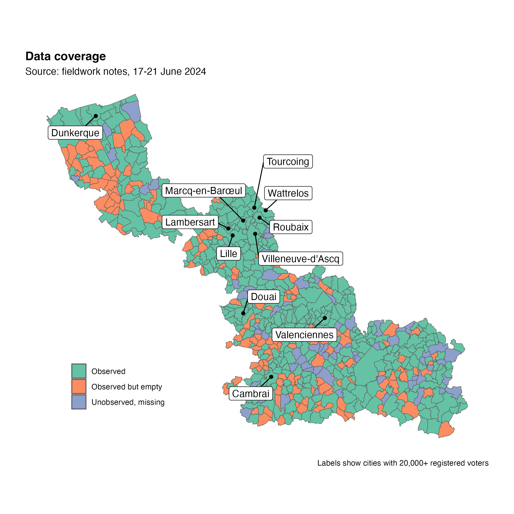

```{r setup, include=FALSE}
knitr::opts_chunk$set(echo = FALSE)

library(sf)
library(tidyverse)

d <- "coverage.tsv" %>%
  readr::read_tsv(col_types = "cciiii") %>%
  mutate(status = case_when(observed == 1 & empty == 1 ~ "Observed but empty",
                            observed == 0 ~ "Unobserved, missing",
                            .default = "Observed") %>%
           factor())

d <- "../electorate/electorate-counts.tsv" %>% 
  readr::read_tsv(col_types = cols()) %>% 
  mutate(code = as.character(code)) %>% 
  select(code, n_ins, n_eur) %>% 
  full_join(d, by = "code") %>% 
  full_join(
    "../../data-cities/population/population.tsv" %>% 
      readr::read_tsv(col_types = "cci") %>% 
      select(-city),
    by = "code"
  )
```

## Weight of missing cities in overall city sample

```{r main-stats}
group_by(d, status) %>% 
  summarise(
    n = n(),
    p_cities = 100 * n() / nrow(d),
    n_ins = sum(n_ins),
    p_ins = 100 * sum(n_ins) / sum(d$n_ins),
    n_eur = sum(n_eur),
    p_eur = 100 * sum(n_eur) / sum(d$n_eur),
  ) %>% 
  add_row(status = "Total", 
          n = nrow(d), p_cities = 100,
          n_ins = sum(d$n_ins), p_ins = 100,
          n_eur = sum(d$n_eur), p_eur = 100) %>%
  knitr::kable(digits = 1, col.names = c("", "Cities", "% cities",
                                         "Voters", "% voters",
                                         "EU voters", "% EU voters"),
               format.args = list(big.mark = ","),
               caption = "Sources: fieldwork notes, prefectural lists.")
```

"Observed but empty" means that the cities were inspected during fieldwork but did not provide a complementary list of EU voters.

Relationship to `n_eur`:

```{r n_eur, echo = TRUE}
# cities with n_eur > 0 should be 'Observed'
table(d$status, d$n_eur > 0)
100 * prop.table(table(d$status, d$n_eur > 0), 1) # 96% covered
```

Remarks:

- The voting lists of 68 cities (10% of total) could not be observed during fieldwork, as they could not be located by the prefectural staff.
- In addition, 152 cities did not separate EU voters from French nationals in their lists, which led us to drop them from the observation pool.
- Roughly 10% of EU voters are registered in these missing cities, which are all small-size cities with less than 5,000 residents:

```{r status-v-city-size, echo = TRUE}
group_by(d, status) %>% 
  summarise(n = n(), median_voterpop = median(n_ins))
```

The amount of missing data is very reasonable, and is unlikely to cause sampling bias.

## Spatial distribution of missing cities



Given the limited amount of missing data, we did not test for complete spatial randomness, but a rough test of median latitude and longitude of the city centroids return only weak and statistically insignificant effects.

```{r csr}
ctr <- readr::read_rds("../../data-cities/geography/city-centres.rds")

xy <- bind_cols(d, as_tibble(sf::st_coordinates(ctr))) %>%
  mutate(north = Y > median(Y), east = X < median(X))

glm(status == "Unobserved, missing" ~ north + east + n_ins, data = xy) %>%
  summary()
```

## Consistency with 2020 model samples

The models are those featured in [Kelbel _et al._ 2024][pag24], which focused on the 2020 municipal elections.

[pag24]: https://doi.org/10.17645/pag.7507

### Consistency with __Model 1__ (restricted to cities > 5,000 residents)

```{r m1}
pb_m1 <- str_c(
  d$city[ d$in_m1 %in% 1 & d$status != "Observed" ], " (",
  d$n_eur[ d$in_m1 %in% 1 & d$status != "Observed" ] %>% 
    format(big.mark = ",", trim = TRUE),
  " registered EU voters)"
)

d %>% 
  mutate(in_m1 = case_when(in_m1 == 1 ~ "Included",
                           in_m1 == 0 ~ "Excluded",
                           .default = "Ignored") %>% 
           factor(c("Included", "Ignored", "Excluded"))) %>% 
  count(in_m1, status) %>% 
  pivot_wider(names_from = in_m1, values_from = n, values_fill = 0) %>% 
  knitr::kable()
```

"Ignored" means that the data contained no EU voters for these cities.

Single problematic case (included in 2020 but unobserved or empty in 2024): 
`r str_flatten_comma(pb_m1)`.

```{r m1_2024}
m1_24_voters <- sum(d$n_eur[ d$pop21 >= 5000 & d$status == "Observed" ])
m1_24_cities <- sum(d$pop21 >= 5000 & d$status == "Observed")
```

Kelbel _et al._ 2024 report a sample size of 6,268 voters in the 101 cities included in Model 1. Using prefectural lists and legal populations of 2021, our estimate is that the same model estimated on the 2024 sample will likely include __`r format(m1_24_voters, big.mark = ",")`__ voters from __`r m1_24_cities`__ cities.

### Consistency with __Model 4__ (estimated on full city sample)

```{r m4}
pb_m4 <- filter(d, in_m4 %in% 1, status != "Observed") %>% 
  arrange(-n_eur)

pb_m4_top5 <- head(pb_m4, 5)

pb_m4_top5 <- str_c(pb_m4_top5$city, " (",
                    format(pb_m4_top5$n_eur, big.mark = ",", trim = TRUE),
                    " EU voters)")

d %>% 
  mutate(in_m4 = case_when(in_m4 == 1 ~ "Included",
                           in_m4 == 0 ~ "Excluded",
                           .default = "Ignored") %>% 
           factor(c("Included", "Ignored", "Excluded"))) %>% 
  count(in_m4, status) %>% 
  pivot_wider(names_from = in_m4, values_from = n, values_fill = 0) %>% 
  knitr::kable()
```

Number of problematic cases (included in 2020 but unobserved or empty in 2024): 
`r nrow(pb_m4)` cities, totalling `r sum(pb_m4$n_eur)` registered EU voters (`r round(100 * sum(pb_m4$n_eur) / sum(d$n_eur), 1)`% of all registered EU voters).

Top 5 problematic cases: `r pb_m4_top5`.

```{r m4_2024}
m4_24_voters <- sum(d$n_eur[ d$status == "Observed" ])
m4_24_cities <- sum(d$status == "Observed")
```

Kelbel _et al._ 2024 report a sample size of 9,827 voters in the 486 cities included in Model 4. Our estimate is that the same model estimated on the 2024 sample will likely include __`r format(m4_24_voters, big.mark = ",")`__ voters from __`r m4_24_cities`__ cities.

## Other checks

Cities with n_eur == 0 should be anything but 'Observed.' There are 21 weird cases where n_eur == 0 but status is 'Observed':

```{r problems}
table(d$status, zero = d$n_eur == 0)
# TODO: check
```
